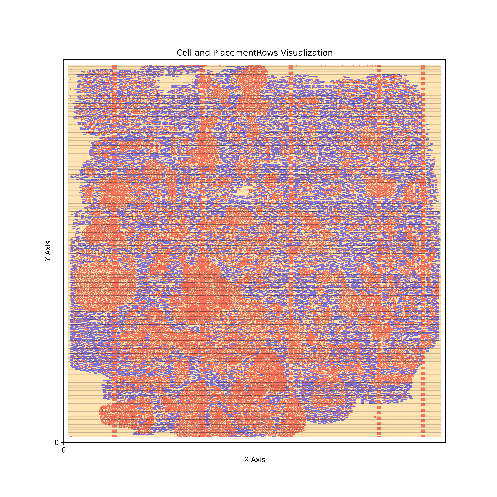
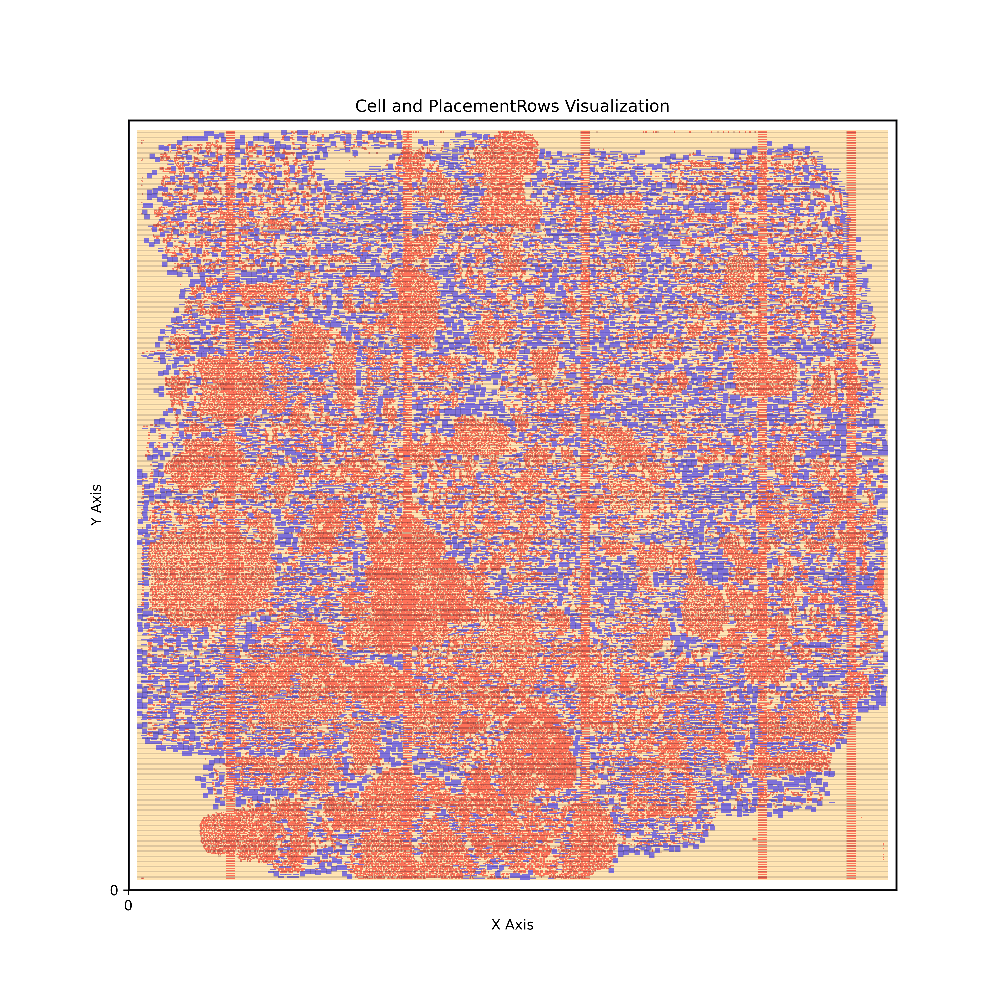

# NYCU_PDA_Lab3 

Detailed problem description can be found here:
[Lab 3 Problem Description](https://hackmd.io/@coherent17/PDA_Lab3)

This repository contains the implementation of **Lab 3: Optimizer and Legalizer Co-optimization**  from the **Physical Design Automation (PDA)**  course at National Yang Ming Chiao Tung University (NYCU). The focus of this lab is on efficient **local legalization**  of standard cells and co-optimization with banking techniques.


Example:

Before banking:


After banking:


---


## Table of Contents 
 
1. [Introduction](https://chatgpt.com/c/674018e5-e898-8001-94b9-f3dee2ec3f9e#introduction)
 
2. [Features](https://chatgpt.com/c/674018e5-e898-8001-94b9-f3dee2ec3f9e#features)
 
3. [Usage](https://chatgpt.com/c/674018e5-e898-8001-94b9-f3dee2ec3f9e#usage)
 
4. [Visualization](https://chatgpt.com/c/674018e5-e898-8001-94b9-f3dee2ec3f9e#visualization)
 
5. [References](https://chatgpt.com/c/674018e5-e898-8001-94b9-f3dee2ec3f9e#references)


---


## Introduction 
In this lab, the challenge is to implement a **local legalizer**  that integrates with an optimization flow for handling multi-row height standard cells. Given a legalized placement and a set of cells to be inserted, the goal is to:
- Maintain placement legality.

- Minimize disturbance to existing placements.

- Ensure efficient execution.

---


## Features 
 
1. **Local Legalizer** :
  - Efficiently places cells into legalized placement without global re-legalization.

  - Supports multi-row height cells.
 
2. **Visualization Tools** :
  - Visualizes placement and local regions using Python scripts.
 
  - Example visualizations are stored in the `./pic` directory.
 
3. **Batch Testing** : 
  - Includes scripts (`./run`, `./eval`) to automate the execution and evaluation of multiple test cases.
 
4. **Advanced Optimization** :
  - Co-optimization with banking techniques for improved placement quality.


---


## Usage 

### Compilation 
Use the provided `Makefile` to compile the project:

```bash
make
```
This generates the executable `Legalizer`.
### Execution 

Run the program with the following command:


```bash
./Legalizer [input_lg_file] [input_opt_file] [output_post_lg_file]
```

#### Example: 


```bash
./Legalizer ./testcase/example.lg ./testcase/example.opt ./testcase/example_post.lg
```

### Batch Testing 

Run all test cases using the scripts:
 
- **Run all cases** :

```bash
./run
```
 
- **Evaluate results** :

```bash
./eval
```


---


## Visualization 

### Tools 
 
1. **`draw_lg.py`** : Visualize a legal placement.

```bash
python3 draw_lg.py [input_file_path] [output_image_path]
```

Example:


```bash
python3 draw_lg.py ./testcase/example.lg ./pic/example.png
```
 
2. **`draw_local_region.py`** : Visualize local regions for placement.

```bash
python3 draw_local_region.py [local_region_file] [output_image_path]
```

Example:


```bash
python3 draw_local_region.py ./testcase/local_region.txt ./pic/local_region.png
```

### Visualized Results 
Example visualizations are stored in the `./pic` directory.

---


## References 

This implementation is based on the following research paper:
 
- **W. -K. Chow, C. -W. Pui, and E. F. Y. Young** , *"Legalization Algorithm for Multiple-Row Height Standard Cell Design,"* DAC 2016.

Additional references:
 
1. **Tetris Legalization** : [Hill, Patent 2002](https://patentimages.storage.googleapis.com/0d/17/0f/8b9dbb9343b70f/US6370673.pdf) .
 
2. **Abacus Legalization** : [Spindler et al., ISPD’08](https://dl.acm.org/doi/pdf/10.1145/1353629.1353640) .